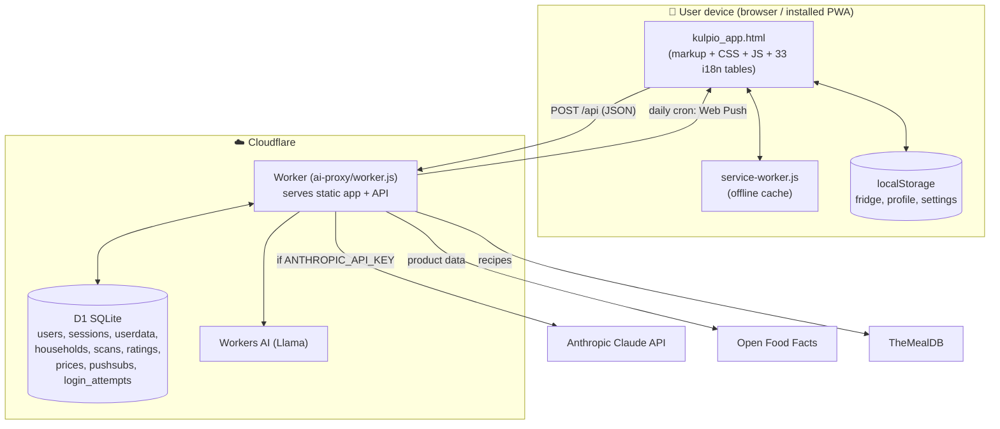
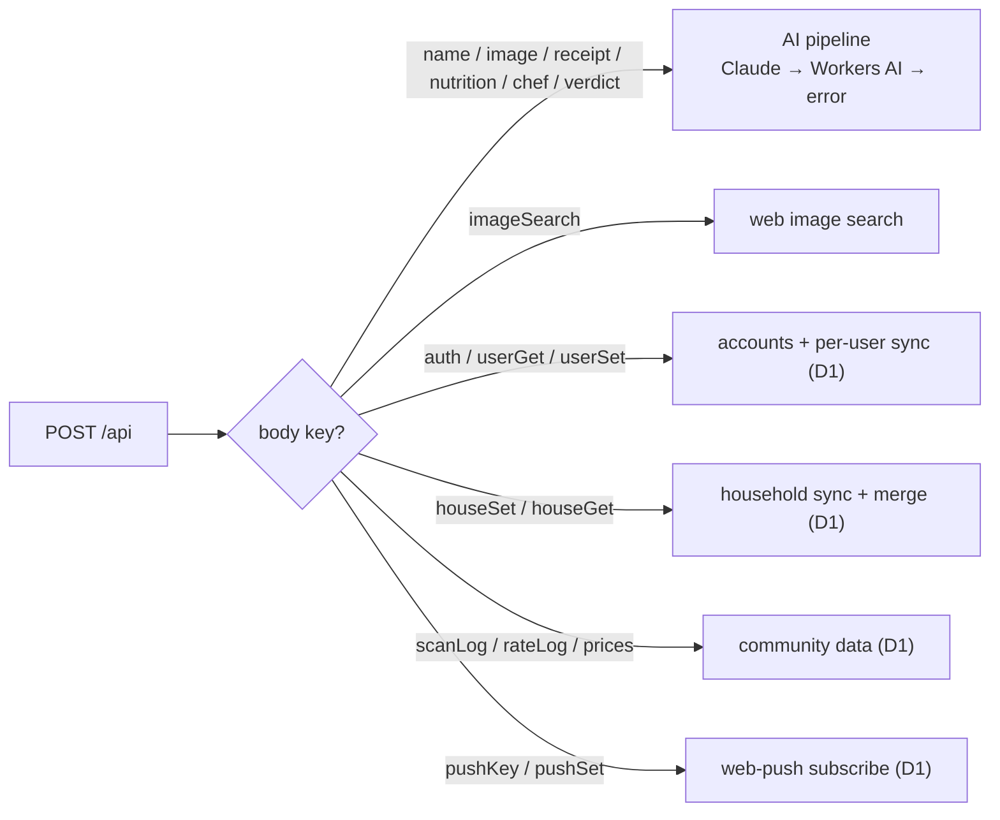
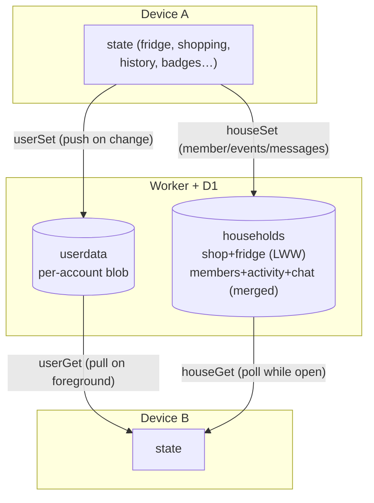

# Kulpio — Architecture

Kulpio is a **single-file offline-first PWA** with one Cloudflare Worker that
serves both the app and its API on the same origin, backed by Cloudflare D1.

## System overview

## Request routing (the Worker)

One Worker handles everything, dispatched by the POST body's key:

The AI pipeline degrades gracefully: **Anthropic Claude** (if the key is set) →
**Cloudflare Workers AI** (free default) → a clean JSON error. The app never
blocks on AI.

## Offline strategy (service worker)

- **HTML / navigation:** network-first (bypassing the HTTP cache) so a new deploy
  always shows, falling back to cache only when offline.
- **Static assets (img/js/css/font):** cache-first, then network.
- **API calls:** network-first so results stay live; cache is a last-resort
  offline fallback.
- **Versioning:** `CACHE_NAME` (`kulpio-vNNN`) is bumped on every app/SW/manifest
  change so installed clients pick up new versions.

## Data & sync model

- **Per-account sync** — a single JSON blob follows the account across devices
  (last-write-wins), flushed on background, pulled on foreground.
- **Household sync** — fridge + shopping list are whole-state last-write-wins, but
  **members, the activity feed and chat are merged server-side** (deduped by id,
  capped, author-stamped) so concurrent devices never clobber each other's
  presence or history.

## Security & privacy

| Concern | Mechanism |
|---|---|
| Password storage | PBKDF2-SHA256, 100 000 iterations (Workers cap), per-user salt |
| Sessions | Opaque 256-bit random tokens, 180-day expiry, server-validated |
| Brute force | `login_attempts` table: 5 failures / 15 min → 429 lockout |
| Shared-fridge codes | 8 chars from a 30-symbol alphabet via CSPRNG (~6.6×10¹¹) |
| Data minimisation | Local-first; nothing leaves the device without a networked feature |
| GDPR — access/portability | In-app JSON **export** of everything held about the user |
| GDPR — erasure | **Delete account & data** wipes user + sessions + synced blob + this device's community rows |
| Push | VAPID; the daily cron sends *empty* pushes — localized copy is cached client-side, so no personal data is in transit |

## Repository layout

| Path | Role |
|---|---|
| `kulpio_app.html` | The entire client app |
| `service-worker.js`, `manifest.webmanifest` | Offline cache + PWA install |
| `ai-proxy/worker.js`, `wrangler.jsonc` | Worker: serves app + API, D1-backed |
| `tests/structure.test.mjs` | Text guard-rails (no dup i18n tables, versioned cache, …) |
| `tests/smoke.js` | Headless Playwright suite (300+ checks), runs offline |
| `tests/worker-*.test.mjs` | Worker auth / push+cron / household-merge (in-memory D1) |
| `docs/` | Project report + this architecture document |
